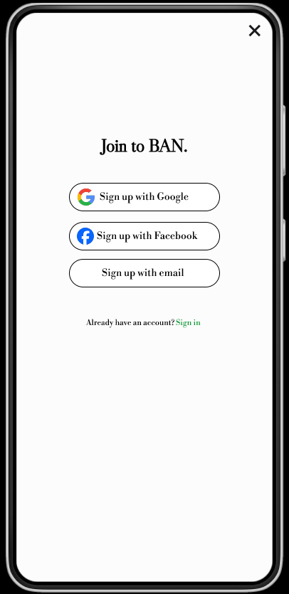
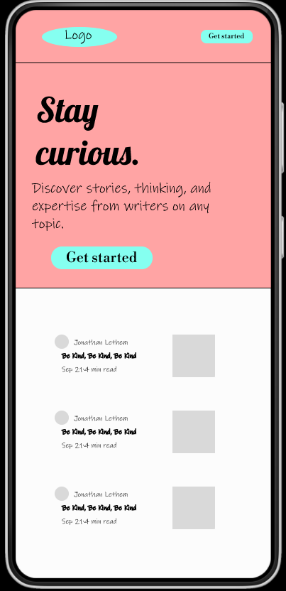
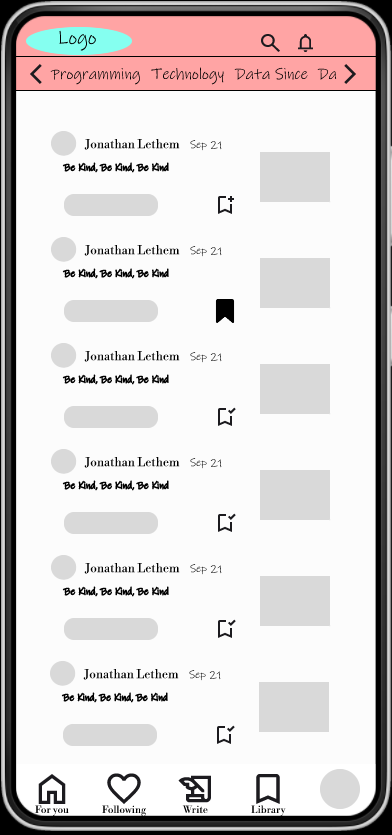
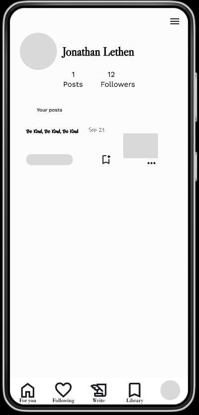
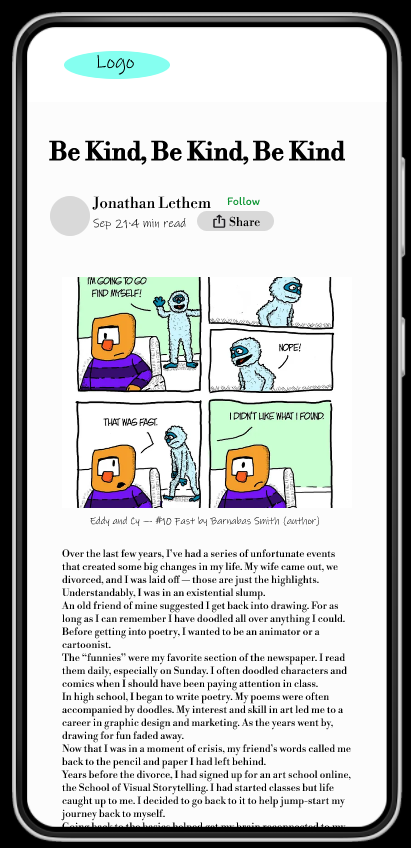

# Blog App

The goal of the project is to allow
the user to make **custom changes** in his blog

## For development , it is used:
- [Python](https://www.python.org/downloads/)
- [Django](https://www.djangoproject.com/)
- [Django REST framework](https://www.django-rest-framework.org/)

# An example of a design that I made myself, it will change in the future

1. **Signup page**
   

2. **Main page**
   

3. **Page after signup or login**
   

4. **Profile page**
   

5. **Article page**
   